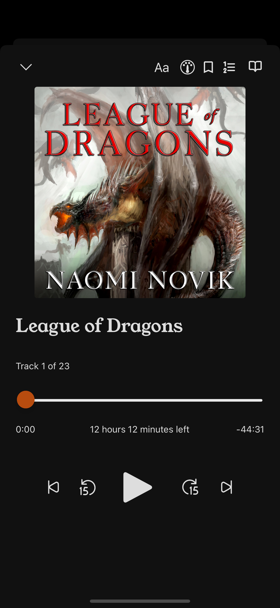

# Storyteller

<table>
  <tbody>
    <tr>
      <td align="center" width="14.28%">
        
      </td>
      <td align="center" width="14.28%">
        
      </td>
    </tr>
  </tbody>
</table>

Want to get started?
[Head over to the documentation site](https://smoores.gitlab.io/storyteller/)!

Storyteller is a self-hosted platform for creating and reading ebooks with
synced narration. It's made of three components: the API server, the web
interface, and the mobile apps. Together, these components allow you to take
audiobooks and ebooks that you already own and automatically synchronize them,
as well as read or listen to (or both!) the resulting synced books.

## Status

This project is in **public beta**. If it looks interesting to you, please, give
it a whirl! Just know that there may still be some bugs. If you run into one of
them, don't hesitate to
[open an issue on GitLab](https://gitlab.com/smoores/storyteller/-/issues/)!

## Contributing

Interested in contributing to Storyteller development? We're working on a
milestone for our initial stable release; check out the work we need to do
[here](https://gitlab.com/smoores/storyteller/-/milestones/2#tab-issues).

If you'd like to work on one of these issues, please say so in the issue
comments on GitLab!

Please take a look at our
[guidelines for developing Storyteller](https://smoores.gitlab.io/storyteller/docs/category/development)
before contributing. These are still a work in progress, so don't hesitate to
reach out with questions!

## How it works

Check out the docs to learn more about
[how Storyteller's forced alignment algorithm works](https://smoores.gitlab.io/storyteller/docs/how-it-works/the-algorithm).

## Contributors

<table>
  <tbody>
    <tr>
      <td align="center" valign="top" width="14.28%"><a href="https://gitlab.com/smoores"> <b>Shane Friedman</b></a> Engineer</td>
      <td align="center" valign="top" width="14.28%"><a href="https://www.sarahmitrano.com/"> <b>Sarah Mitrano</b></a> Designer (mobile apps)</td>
    </tr>
  </tbody>
</table>
