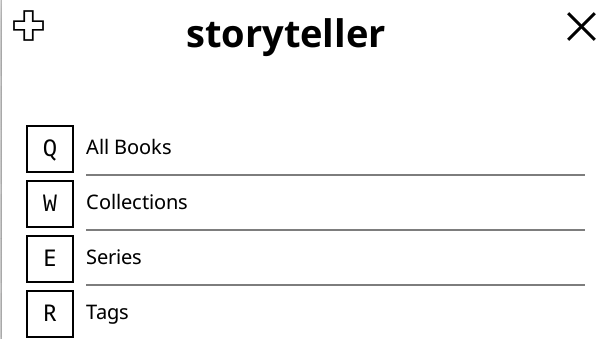
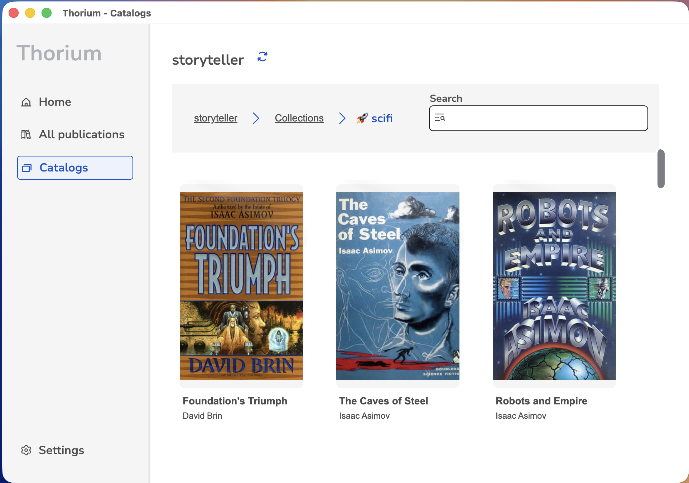

Heya!

We're excited to announce the release of Storyteller v2.6.0! This release
includes support for [OPDS](https://opds.io/), which allows you to browse and
download books from your library on devices that may not support the Storyteller
apps.

Currently we only support [OPDS v1.2](https://specs.opds.io/opds-1.2), but we
plan to support [v2.0](https://drafts.opds.io/opds-2.0) in the future.

## How to access

The OPDS feed is available at `https://<storyteller-server>/opds`. Just add it
to your OPDS client and you should be good to go!

## Authentication methods

Storyteller implements the
[OPDS Authentication 1.0](https://opds-spec.org/specs/authentication/1.0/index.html)
specification. Compatible clients will allow you to login with OAuth for
instance.

At the time of writing, only
[Thorium Reader](https://www.edrlab.org/software/thorium-reader/) appears to
implement this specification, all other clients tested only support basic
authentication.

## Settings

There are three settings available for OPDS:

- **Enable OPDS feed**: Whether to enable the OPDS feed.
- **Enable pagination**: Whether to enable pagination for the OPDS feed. Some
  clients (like Boox PushRead) do not support pagination. You can disable this
  to return all items in a single response.
- **Page size**: The number of items per page in the OPDS feed.

## Caveats

Unfortunately, due to the nature of OPDS, while we can make your books available
on devices that don't support the Storyteller apps, we can't keep track of your
progress when you read books this way. For KOReader you could try using
[ABS-KoSync Bridge](https://github.com/cporcellijr/abs-kosync-bridge), which
also syncs with Storyteller.

## Tested clients

These are the clients we've tested at time of writing. See the
[OPDS documentation](/docs/reading/opds) for an up-to-date list of supported
clients.

### Works

- [Thorium Reader](https://www.edrlab.org/software/thorium-reader/) Only one who
  supports reading Readalouds and audiobooks.
- [Cantook](https://cantook.app/)
- [Boox PushRead](https://help.boox.com/hc/en-us/articles/10992026883732-PushRead)
  (Images may not work)
- [KOReader](https://koreader.rocks/)
- [Yomu](https://yomu.app/)
- [KyBook](http://kybook-reader.com/)
- [FBReader](https://fbreader.org/)

### Does not work

- [MoonReader+](https://moonreader.app/) (Only tested on an older version, let
  us know if you can confirm it works with a newer version)

## Troubleshooting & Feedback

If you're having trouble accessing your library with OPDS, or if you want to see
another client added to the list, feel free to reach out to us on
[Discord](https://discord.gg/KhSvFqcrza) or open an issue on
[GitLab](https://gitlab.com/storyteller-platform/storyteller/-/issues).
