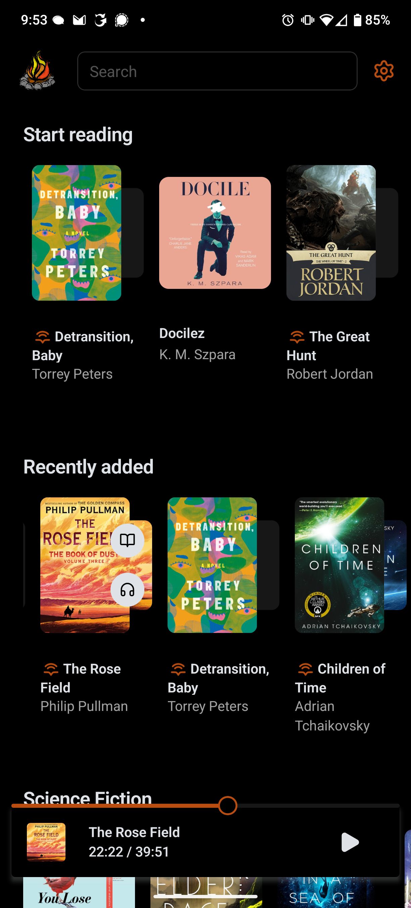
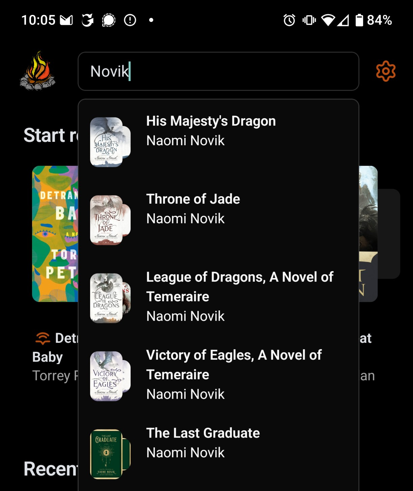

Merry Christmas!

I’m _absolutely jazzed_ (and not a little relieved) to announce the first v2
release of the Storyteller mobile apps! This has been a long time coming — the
new apps represent a vision that’s been in the works for 9 months, starting with
the first commit to the web v2 branch.

<!-- truncate -->

## Overview

- Design refresh: new home screen and updated UI
- Search for books
- Support standalone audiobooks and ebooks!
- Move to a browser-based login flow that supports OAuth login
- Browse your server’s books even when you’re offline
- View books by author, tag, collection, and series
- Improved table of contents in listen mode for readaloud books
- Log in to multiple servers at once
- Edit and delete custom themes and fonts
- Choose a custom readaloud color

## Updating

Once the apps are available in the app stores, you can install the new version.
Your app will automatically migrate on startup. If you run into any issues,
please reach out on GitLab or Discord!

Note: When you first upgrade to v2, you will be logged out of the app. Click on
the settings gear in the top right, click on Log in, and follow the auth flow to
log back in!

## Design refresh

The app has a new home screen, modeled after the web app’s home page. See your
books organized by status and collection. We’ve also made long lists of books
_much_ snappier to load and scroll through.

Across the app, you’ll notice smaller UI improvements as well. Better spacing,
better sliders, better toggles, etc.

## Search for books

You can now search for books from the home screen. You can search for books by
title, author, series, or tag.

## Support for standalone audiobooks and ebooks

You can finally read and listen to your standalone audiobooks and ebooks on the
Storyteller app! You can even download just the ebook for a readaloud if you’re
short on bandwidth, and then switch to the full readaloud later when you’re on
WiFi. We’ll keep your place!

Note: Switching between the standalone ebook and audiobook for a single book
will currently lose your place. In the future, we’ll be able to roughly keep
your position in this situation!

## Browser-based login flow

The Storyteller mobile apps now use your mobile browser to log in. This means
that if you’re logged in to the web app on your mobile device, clicking the Log
in button in the app will automatically log you in instantly!

It also means that you can use OAuth to log in to the mobile apps. Now that this
is available, a future web app release will include a setting that allows users
to disable non-OAuth login for their servers!
