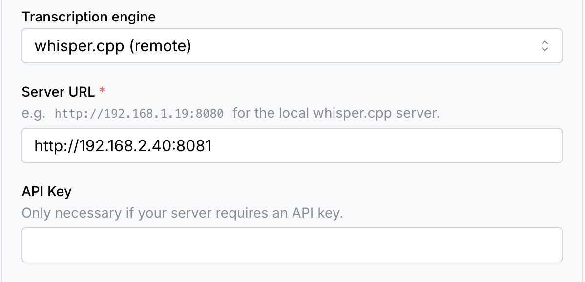

import Tabs from "@theme/Tabs"
import TabItem from "@theme/TabItem"

# Compiling `whisper.cpp` from source for remote transcription

:::note

We suggest you use this guide if you are unable to use
[`ghost-story`, our official remote transcription solution](tutorials/offloading-transcription.mdx).

Storyteller makes some specific assumptions about that specific setup when using
the `whisper.cpp (remote)` transcription option which can provide a better
transcription experience.

:::

You can compile `whisper.cpp` locally to take advantage of GPU acceleration
available on your machine. This can speed up transcription compared to the
default CPU implementation without using a cloud service.

The overall goal is to run `whisper.cpp`'s built-in web server directly on your
machine ("bare metal"), while running Storyteller in a Docker container as
usual. Choose a build path that matches your hardware: CPU is simpler to set up,
while GPU is faster on supported hardware.

## 0. Prerequisites

<Tabs groupId="operating-systems">
<TabItem value="win" label="Windows">

The commands in this guide are written for PowerShell. Run PowerShell as
Administrator only when installing prerequisites.

```powershell
winget install Git.Git
winget install Kitware.CMake
winget install ffmpeg
```

You will also need the
[Visual Studio Build Tools](https://visualstudio.microsoft.com/visual-cpp-build-tools/)
with the Visual C++ workload installed.

</TabItem>
<TabItem value="mac" label="macOS">

```bash
brew install cmake git ffmpeg
```

</TabItem>
</Tabs>

## 1. Clone whisper.cpp

<Tabs groupId="operating-systems">
<TabItem value="win" label="Windows">

```powershell
cd C:\
git clone https://github.com/ggml-org/whisper.cpp.git
cd C:\whisper.cpp
```

</TabItem>
<TabItem value="mac" label="macOS">

```bash
git clone https://github.com/ggml-org/whisper.cpp.git
cd whisper.cpp
```

</TabItem>
</Tabs>

## 2. Download a model

Smaller models use less VRAM and are faster. Larger models are more accurate but
require more VRAM. If you're not sure which model you need, start with `tiny.en`
for English and `large-v3-turbo` for other languages. If you have issues with
alignment using `tiny`, try upgrading to `large-v3-turbo`.

<Tabs groupId="operating-systems">
<TabItem value="win" label="Windows">

Download a model file from the
[whisper.cpp model repository on Hugging Face](https://huggingface.co/ggerganov/whisper.cpp/tree/main)
and place the `.bin` file in the `whisper.cpp` folder.

</TabItem>
<TabItem value="mac" label="macOS">

```bash
sh ./models/download-ggml-model.sh tiny.en
```

Available models: `tiny.en`, `tiny`, `base.en`, `base`, `small.en`, `small`,
`medium.en`, `medium`, `large-v1`, `large-v2`, `large-v3`, `large-v3-turbo`.

</TabItem>
</Tabs>

## 3. Building

<Tabs groupId="operating-systems">
<TabItem value="win" label="Windows">

<Tabs groupId="win-gpu">
<TabItem value="cpu" label="CPU">

```powershell
cmake -B build
cmake --build build -j --config Release
```

</TabItem>
<TabItem value="nvidia" label="NVIDIA (CUDA)">

Download the [CUDA Toolkit](https://developer.nvidia.com/cuda-downloads) and
note the install path.

```powershell
cmake -B build -DGGML_CUDA=1 -DCUDAToolkit_ROOT="C:\Program Files\NVIDIA GPU Computing Toolkit\CUDA\vXX.X"
cmake --build build -j --config Release
```

Update the toolkit path and version to match your installation.

</TabItem>
<TabItem value="amd" label="AMD (HIP/ROCm)">

Install the
[AMD HIP SDK for Windows](https://www.amd.com/en/developer/resources/rocm-hub/hip-sdk.html).

```powershell
cmake -B build -DGGML_HIP=ON
cmake --build build -j --config Release
```

</TabItem>
<TabItem value="vulkan" label="Vulkan">

Download the [Vulkan SDK](https://vulkan.lunarg.com/sdk/home).

```powershell
cmake -B build -DGGML_VULKAN=1
cmake --build build -j --config Release
```

</TabItem>
<TabItem value="openvino" label="OpenVINO">

This requires Python. Follow the
[OpenVINO support section](https://github.com/ggml-org/whisper.cpp?tab=readme-ov-file#openvino-support)
in the whisper.cpp README.

</TabItem>
</Tabs>

</TabItem>
<TabItem value="mac" label="macOS">

To use CoreML acceleration you need to set up a Python environment and install
the required dependencies. Using [`uv`](https://github.com/astral-sh/uv):

```bash
uv venv
source ./venv/bin/activate
uv pip install ane_transformers openai-whisper coremltools
```

You will also need the full Xcode application from the App Store (not just the
CLI tools). To ensure you are using the correct version:

```bash
sudo xcode-select --switch /Applications/Xcode.app/Contents/Developer
```

Build whisper.cpp with CoreML support:

```bash
cmake -B build -DWHISPER_COREML=1
cmake --build build -j --config Release
```

Convert the model to CoreML format:

```bash
export MODEL_NAME=tiny
./models/generate-coreml-model.sh $MODEL_NAME
```

Replace `tiny` with the model you downloaded in the previous step.

</TabItem>
</Tabs>

See the
[whisper.cpp documentation](https://github.com/ggml-org/whisper.cpp/blob/master/docs/README.md)
for more information on other acceleration options.

## 4. Running the server

<Tabs groupId="operating-systems">
<TabItem value="win" label="Windows">

Use a `.bat` file to start the server so you can switch models or settings
quickly. Update the model file name before running.

<Tabs groupId="win-gpu">
<TabItem value="cpu" label="CPU">

```bat title="start-whisper.bat"
@echo off
cd /d C:\whisper.cpp
start "" /b build\bin\Release\whisper-server.exe -m ggml-large-v3-turbo.bin --host 0.0.0.0 --port 8080 --inference-path /audio/transcriptions --convert > whisper-server.log 2>&1
echo Whisper server started in background
echo Logs: C:\whisper.cpp\whisper-server.log
```

</TabItem>
<TabItem value="nvidia" label="NVIDIA (CUDA)">

```bat title="start-whisper.bat"
@echo off
cd /d C:\whisper.cpp
set "PATH=C:\Program Files\NVIDIA GPU Computing Toolkit\CUDA\vXX.X\bin;%PATH%"
start "" /b build\bin\Release\whisper-server.exe -m ggml-large-v3-turbo.bin --host 0.0.0.0 --port 8080 --inference-path /audio/transcriptions --convert > whisper-server.log 2>&1
echo Whisper server started in background with CUDA support
echo Logs: C:\whisper.cpp\whisper-server.log
```

Update the CUDA toolkit path and version to match your installation.

</TabItem>
<TabItem value="amd" label="AMD (HIP/ROCm)">

```bat title="start-whisper.bat"
@echo off
cd /d C:\whisper.cpp
start "" /b build\bin\Release\whisper-server.exe -m ggml-large-v3-turbo.bin --host 0.0.0.0 --port 8080 --inference-path /audio/transcriptions --convert > whisper-server.log 2>&1
echo Whisper server started in background
echo Logs: C:\whisper.cpp\whisper-server.log
```

</TabItem>
<TabItem value="vulkan" label="Vulkan">

```bat title="start-whisper.bat"
@echo off
cd /d C:\whisper.cpp
start "" /b build\bin\Release\whisper-server.exe -m ggml-large-v3-turbo.bin --host 0.0.0.0 --port 8080 --inference-path /audio/transcriptions --convert > whisper-server.log 2>&1
echo Whisper server started in background
echo Logs: C:\whisper.cpp\whisper-server.log
```

</TabItem>
<TabItem value="openvino" label="OpenVINO">

```bat title="start-whisper.bat"
@echo off
cd /d C:\whisper.cpp
start "" /b build\bin\Release\whisper-server.exe -m ggml-large-v3-turbo.bin --host 0.0.0.0 --port 8080 --inference-path /audio/transcriptions --convert > whisper-server.log 2>&1
echo Whisper server started in background
echo Logs: C:\whisper.cpp\whisper-server.log
```

</TabItem>
</Tabs>

Check `whisper-server.log` for device initialization. Example output for NVIDIA:

```
ggml_cuda_init: found 1 CUDA devices:
  Device 0: NVIDIA GeForce RTX 5070 Ti, compute capability 12.0, VMM: yes
```

</TabItem>
<TabItem value="mac" label="macOS">

```bash
./build/bin/whisper-server -m models/ggml-$MODEL_NAME.bin \
  --host 0.0.0.0 \
  --inference-path /audio/transcriptions \
  --suppress-nst \
  --convert
```

</TabItem>
</Tabs>

Key flags:

- `-m` specifies the model file path.
- `--host 0.0.0.0` allows access from other devices on the network.
- `--inference-path /audio/transcriptions` matches the URL that Storyteller
  expects.
- `--convert` allows the server to accept non-`wav` files.
- `--port` overrides the default port (8080) if another service is using it.
- `--suppress-nst` (required) suppresses non-speech tokens. May result in
  alignment issues if omitted.
- `--flash-attn` (optional) enables flash attention. May result in faster
  transcription
- `--processors` (optional) sets the number of processors to use. Defaults to 1,
  but can be increased for faster transcription.

:::warning

Increasing the number of processors may _drastically_ speed up transcription,
but it may also result in alignment issues. Please do not raise an alignment
issue if you have increased the number of processors.

:::

## 5. Configuring Storyteller

In the Storyteller settings, under "Transcription settings", set the following:

- "Transcription engine" to "`whisper.cpp (remote)`"
- "API Key" can be left empty or set to any string, as the local server does not
  require authentication.
- "Base URL" to the URL of the whisper.cpp server, for example
  `http://192.168.2.40:8080`.



The default port is `8080` but you can change it with the `--port` flag.

### Determining the server host

The base URL must contain the IP address or hostname of the machine running the
whisper.cpp server.

**Storyteller in Docker (macOS or Windows):** use `host.docker.internal` as the
hostname.

**Storyteller in Docker (Linux):** run the container with
`--add-host=host.docker.internal:host-gateway` and use `host.docker.internal`,
or use `--network=host` and `localhost`.

**Storyteller on the same machine:** use `localhost`.

**Storyteller on a different machine:** find the server's IP address with
`ifconfig` (macOS) or `ipconfig` (Windows) and look for addresses starting with
`192.168.`.
