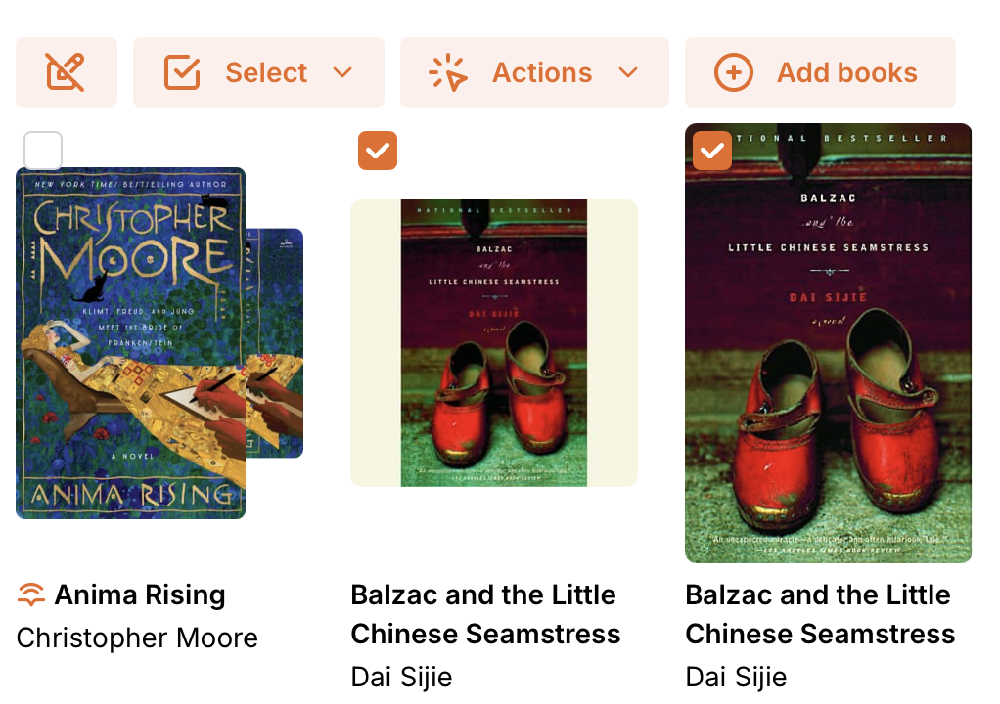
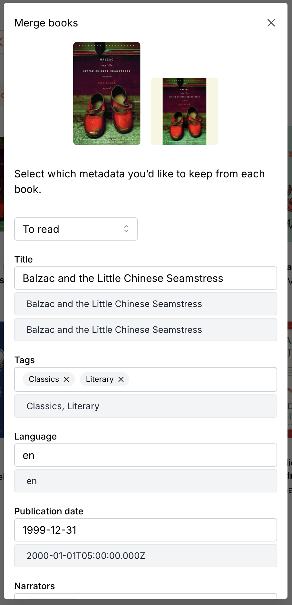

# Adding books

Before you can [align books](managing/aligning.md), you have to upload them!

Storyteller allows you to add audio books (individual files or folders of files)
and ebooks in the EPUB format. You can upload just the audiobook, just the
ebook, or upload them as a matched pair.

If you upload one version and then upload the other version later, you can pair
them together on the server to match them for alignment.

There are three ways to add books to a Storyteller library.

## Uploading books through the web client

You can upload books one at a time through the web client. When uploading a
book, you can upload either a single readaloud EPUB file, plain EPUB file, or
audiobook file(s), or both a plain EPUB and audiobook file(s). If you upload
both a plain EPUB file and audiobook file(s), they will be matched, and
Storyteller will treat them as a single book asset with one set of metadata. You
will also be able to align them to create a readaloud book!

You can upload books from the home page, the Books page, or any collection page.
If you upload from a collection page, the book will automatically be added to
that collection.

Books that are uploaded through the web client will live in Storyteller’s
`/data` directory. You should always mount a Docker volume to `/data` when
[configuring your Storyteller container](installation/self-hosting.md#docker-compose),
so that these files are accessible outside the container (and so that they
aren’t deleted when your container is updated!).

## Importing books from the server

If you already have book files on your server and you’d just like to import them
into Storyteller, you can manually import books one at a time. This is very
similar to uploading books, but you can choose from files that are already
available on your server, rather than uploading through the web client.

When importing books from the server, the originals are not copied or moved into
Storyteller. The books remain in their original location. _Be aware that changes
to metadata made in Storyteller will be written into these files._ So if those
files are being managed by other software, you may want to take care with this
option. (The same is true for watch folders which are discussed next.)

## Auto-import from a watched folder

You can also configure Storyteller to automatically import books from a folder
on your server. You can make this folder available to your Storyteller container
by mounting it as a volume on your container. For example, if we have our books
library in `~/Media/Books`, the following Docker compose configuration will make
our books available at `/library` inside the container:

```yaml
services:
  web:
    image: registry.gitlab.com/storyteller-platform/storyteller:latest
    volumes:
      - ~/Documents/Storyteller:/data:rw
      # Our new volume mount
      - ~/Media/Books:/library:rw
    environment:
      - STORYTELLER_SECRET_KEY_FILE=/run/secrets/secret_key
    ports:
      - "8001:8001"
    secrets:
      - secret_key

secrets:
  secret_key:
    file: ./STORYTELLER_SECRET_KEY.txt
```

### Organizing your auto-import folder

Storyteller tries to be relatively un-opinionated about how auto-import folders
are organized, but there is one very important rule:

**Every book needs to be in its own folder.**

Here is an example library folder, demonstrating the various ways to organize
files that Storyteller is able to understand:

```
/
  library/
    Mary Shelley/
      Frankenstein/
        Frankenstein.epub
    Mathilda/
      Mathilda.m4b
    Willy Wonka/
      Willy Wonka.epub
      Willy Wonka.mp3
    Moby Dick/
      Moby Dick (readaloud).epub
    Children's novels/
      The Adventures of Pinocchio/
        Pinocchio.epub
        audio/
          Track 001.mp3
          Track 002.mp3
          Track 003.mp3
          Track 004.mp3
          Track 005.mp3
```

Some important notes about the allowed structure:

- As mentioned above, each book must be in its own folder. This is true even
  when there is only one file for that book.
- Book files in the same folder will be matched and considered a single book.
  This is equivalent to uploading ebook and audiobook files together, as
  described above
- Audiobooks can have any number of files, and they can be either directly
  alongside the EPUB files or nested within another folder
- All formats (ebook, audiobook, and readaloud) are optional
- Book folders can be nested arbitrarily. They can be organized by genre or
  author, for example, or simply listed flat at the root of the directory.

### Configuring auto-import

You can configure Storyteller to automatically import from a folder in two
places:

1. In the Settings page. Books imported from the folder configured here will not
   be assigned to a collection, and will show up in “Uncollected”
2. In the settings for a Collection page, which can be accessed by clicking on
   the gear next to the Collection’s name. Books imported from the folder
   configured here will be automatically assigned to the collection.

You can configure both a top-level auto-import folder and any number of
per-collection folders. Just make sure that they don’t overlap, or you’ll end up
with duplicate books!

---

## Matching books after the fact

If you import both versions at the same time or auto-import them in the same
folder, they will appear as a single item in the library represented with a dual
thumbnail. If you import a readaloud book, it is represented by the presence of
the readaloud icon preceding the title of the book below the thumbnail.


If they are imported at different times, you will need to match them together
first.

Matching books is valuable even if you do not want to align them as it gives you
one place to update metadata for the book as well as your notes, ratings and
statuses for the book.



To match two books, select them via the bulk actions function and choose "merge
books". A dialog will appear to help you merge and update the metadata for the
new single entry for the books.



Once this is done, the ebook and the audiobook are recognized as a single
'book', and alignment can proceed. Additionally, your reading status will be
preserved, regardless of which of the media you are using.

---
