# Settings

## Setting up the admin user

When you first run the Storyteller backend, the web interface will prompt you to
create an admin user. This user will be saved in the database and given all
permissions in the system.

### Logging In

After creating the admin user, you will be prompted to sign in with your new
username (or email address) and password.

### Welcome to Storyteller!

Congrats, you're now a server admin! Luckily, the Storyteller backend is pretty
straightforward to administer. This is what your empty library looks like:

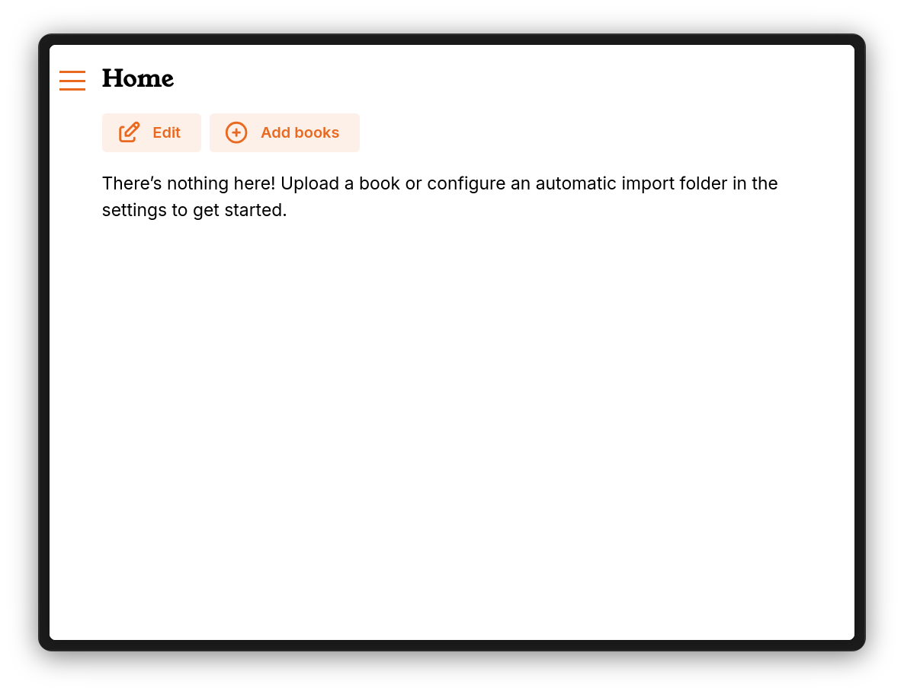

If you ever need to change any of your account settings, they are easy to access
in your account.

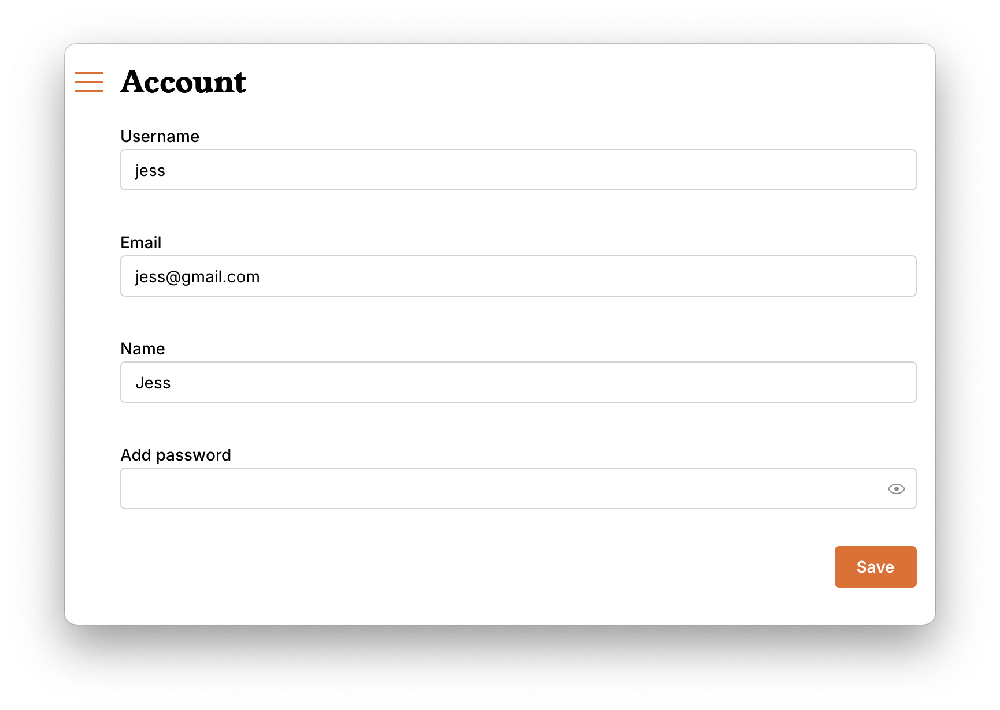

The first thing you may want to do with your new server is to go to the settings
page and set some defaults.

---

## Library Settings

You do not need to add setting here unless you are planning to share your
library with friends and family, but it is still important to understand where
to reach your server. Putting the correct web URL here will mean you always have
a place to go and quickly grab it.

As a default, your Storyteller library will be available to you

- on the server in any web browser at http://localhost:8001
- on any device (web browser and apps) on your local area network at the local
  IP address for the server such as http://192.168.1.xxx:8001

If you want to access your server remotely, you must either

- open port 8001 on your network (not recommended)
- use a reverse-proxy (if you do not want to expose a port on the open internet)
- follow the [Tailscale community guide](community-guides/tailscale.md) to use
  your Tailscale URL, which will be something like
  https://storyteller.tail-scale.ts.net/

Putting the full URL — _including the proper URL scheme (http:// or https://)_ —
is best practice and may save you some confusion down the road.

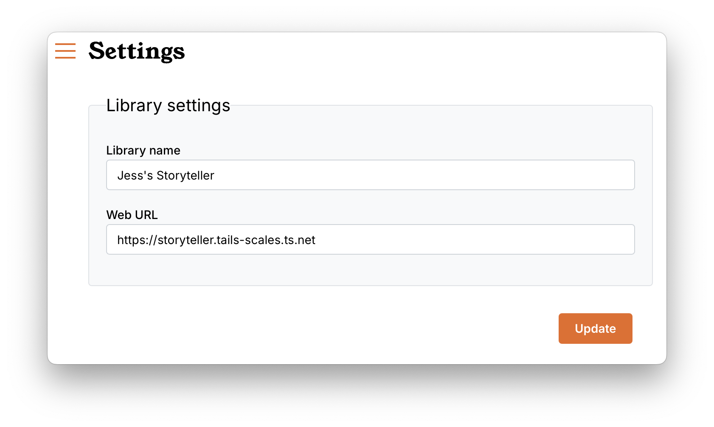 There are plans to have the
ability to be connected to multiple Storyteller libraries at the same time (à la
Plex), so give your library a distinctive name.

---

## Automatic Import

You can upload books one at a time through the web client, import them from
another server or set up automatic imports. Automatic imports can be uncollected
or based on particular collections. For uncollected books, the watch folder is
defined here.

**_Be aware that uncollected books are visible to all users._** Any books you do
not want shared with all users should be imported or added directly into a
collection.

A full discussion and instructions on
[how to add books to Storyteller](managing/adding.md) as well as set up
automatic imports into specific collections is found elsewhere in this
documentation, but this setting is where you designate the watch folder for
_uncollected_ books.

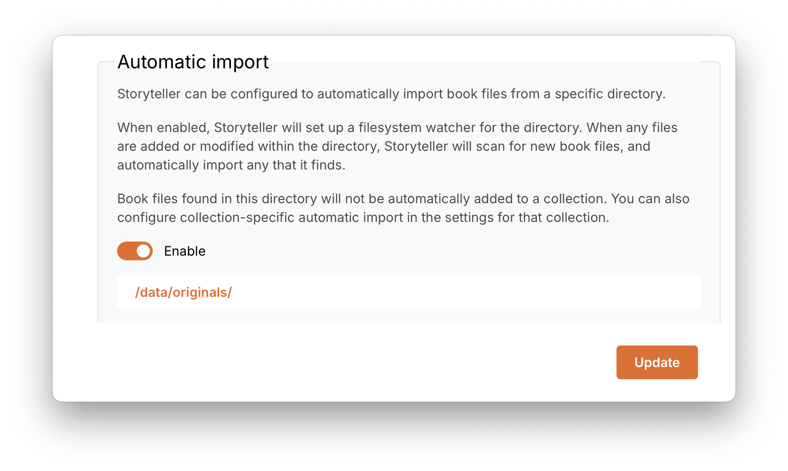

---

## Readaloud Location

When you manually or automatically import files into Storyteller from your
server, rather than uploading them, Storyteller leaves your files in place. When
Storyteller generates a readaloud file for books imported in this way, by
default it will place the readaloud EPUB file next to the input EPUB file, with
the suffix ` (readaloud)`.

If we generated a readaloud for “Willy Wonka”, in the above example, Storyteller
would create a new file at `/library/Willy Wonka/Willy Wonka (readaloud).epub`.

This behavior can be configured in the Storyteller settings if desired. The
options are:

- In the same folder as the input EPUB file, with a user-provided suffix
  (defaults to ` (readaloud)`).
- In a user-provided folder name next to the EPUB file (defaults to
  `readaloud/`).
- In a user-provided folder somewhere outside the auto-import folder.
- In the Storyteller internal folder, alongside the transcoded audio and
  transcription files.

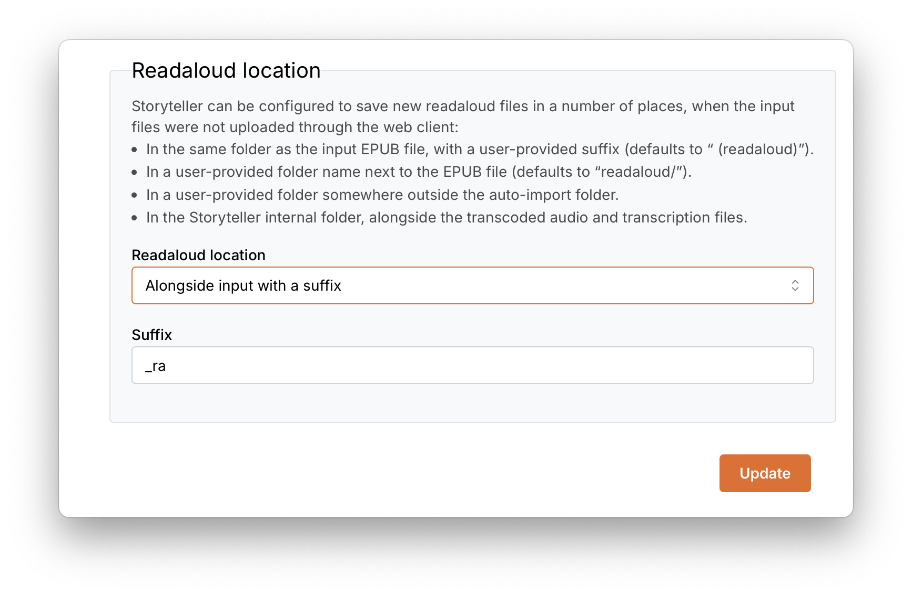

---

## Audio Settings

### Max track length

Storyteller can automatically split tracks longer than a given length. This will
reduce the memory consumption of the transcription step. The default is 2 hours,
but shorter values will result in less memory usage during transcription.

Storyteller will use silence detection to attempt to split tracks between
sentences, so as to not interfere with transcription. In practice, this works
very well!

### Transcoding

Audio files are "encoded", usually with some amount of compression. Different
encoders will have different effects on audio — some are better for music,
others better for speech, etc. Storyteller supports three audio codecs: MP3, AAC
(typically used in MP4/M4A/M4B files), and OPUS. OPUS is particularly efficient
at compressing human speech, and can result in significantly smaller output
files.

As part of its audio pre-processing step, Storyteller can transcode your audio
files using any of these codecs. If you'd like to enable transcoding, go to the
Settings page of your Storyteller instance and set "Preferred audio codec".
Depending on your choice, you may be presented with a choice of bitrate as well.
Generally speaking, the defaults are reasonable, lower numbers mean lower
quality (and smaller files), and higher numbers mean higher quality (and larger
files).

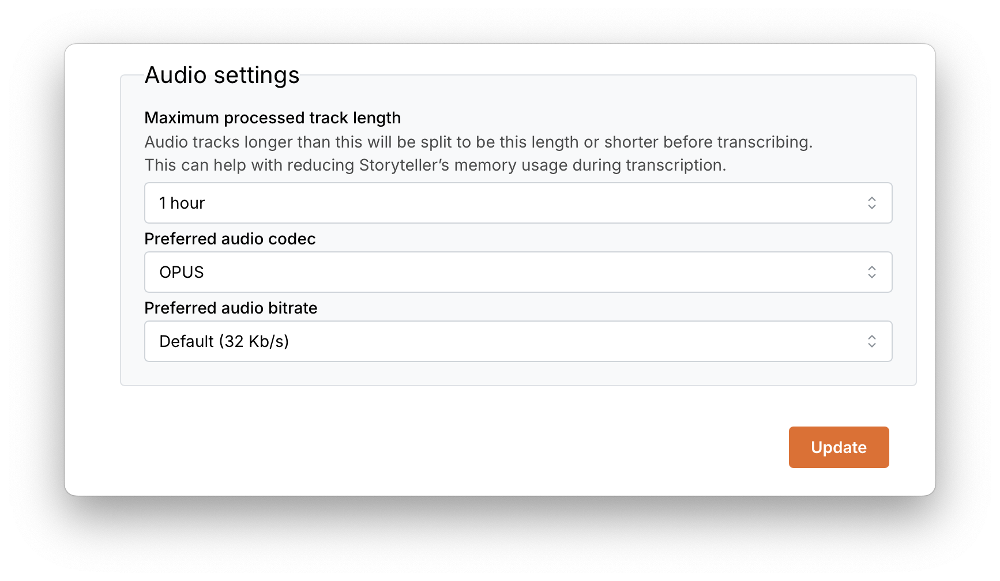

Many Storyteller users have found that the OPUS codec and a bit rate of 32 kb/s
provides a good balance of audio fidelity to file size.

Please note that enabling transcoding will significantly slow down the
pre-processing step! You can improve transcoding performance by increasing the
maximum simultaneous transcodes in the parallelization settings — the ideal
number is the number of cores that you have available for Storyteller to use,
minus 1.

---

## Transcription Settings

As part of the alignment process, Storyteller attempts to transcribe the
audiobook narration to text (visit [How it works!](the-algorithm.md) for more
details.) This is by far the most resource-intensive phase of the alignment
process.

### Transcribing locally

The default transcription engine is whisper.cpp, which runs the open source
[whisper.cpp](https://github.com/ggerganov/whisper.cpp) project locally.
Storyteller clones and builds whisper.cpp at runtime. This means that it may
take several minutes before your first transcription task actually begins, while
whisper.cpp is being built.

You can specify which Whisper model Storyteller should use for transcription.
The default (tiny) is sufficient for most English books. For books with many
uncommon words, or in languages other than English, you may need to try larger
models, such as small or medium.
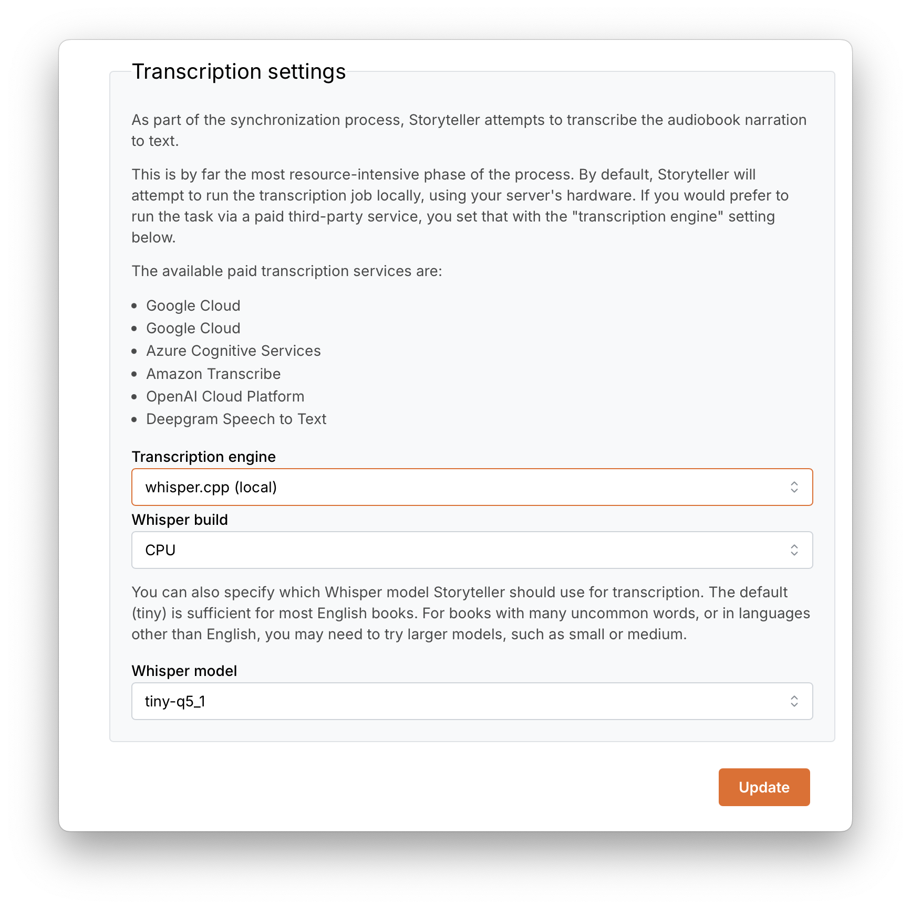 If your hardware
allows, you can accelerate transcription by harnessing your GPU. The available
acceleration frameworks are:

#### NVIDIA GPUs

- cuBLAS-11.8. This is a CUDA-based BLAS library. It requires a CUDA-enabled
  NVIDIA GPU. Specifically, this is for GPUs with CUDA 11; use cuBLAS-12.4 if
  you are running CUDA 12
- cuBLAS-12.4. Same as cuBLAS-11.8, but for CUDA 12.

#### AMD GPUs:

- hipBLAS. This is an AMD-based BLAS library. It requires an AMD GPU that
  supports the ROCm computation framework, and for the AMD GPU drivers to be
  installed on the host

Additionally, we have a community guide for how to use CoreML for
hardware-accelerated transcription on macOS.

### Transcribing via paid third-party service

By default, Storyteller will attempt to run the transcription job locally, using
your server's hardware. If you prefer to run the task via a paid third-party
service, you set that with the "transcription engine" The available paid
transcription services are:

- [Google Cloud Speech-to-text AI](https://cloud.google.com/speech-to-text)
- [Azure Cognitive Services](https://azure.microsoft.com/en-us/products/ai-services/speech-to-text/)
- [Amazon Transcribe](https://aws.amazon.com/transcribe/)
- [OpenAI Cloud Platform](https://platform.openai.com/)
- [DeepGram Speech to Text](https://deepgram.com/product/speech-to-text)

To use any of these services, you must first set up an account with the service
provider, and obtain any relevant API keys and configuration. You can then
configure Storyteller to use your account for transcription.

---

## Parellelization Settings

These settings will speed up the time needed to transcode and/or transcribe your
audiobooks.

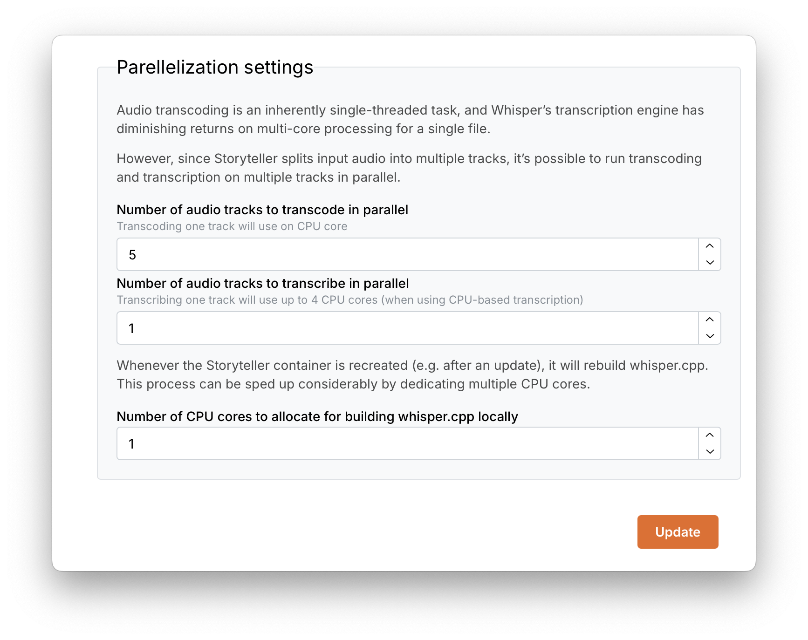

    
What is the difference between transcoding and transcribing?

**Transcoding** is the process by which an audio file is reprocessed and saved
as another type of audio file. In Storyteller, you have the ability to chose
alternate codecs and bitrates from your original files. This can lead to
markedly smaller files without much lose of fidelity.

**Transcribing** is the process by which all of the spoken words in the audio
file are turned into a time-stamped text file which is then used in the
alignment phase of the process.

---

## Authentication Providers

If you’d like to set up an OAuth provider for Storyteller, you can do so here.
If you don’t have any idea what OAuth or OIDC are, you can just skip this
section!

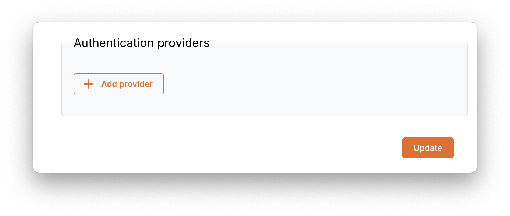

### Setting the `AUTH_URL` environment variable

In order to use OAuth, you _must_ set the `AUTH_URL` environment variable in
your container. It should be set to your Storyteller server’s origin (scheme +
hostname), with the path `/api/v2/auth`. So if you access your Storyteller
instance at `https://storyteller.example.com`, then you should set `AUTH_URL` to
`https://storyteller.example.com/api/v2/auth`.

### Configuring a provider

Storyteller supports a large number of built-in providers, like Auth0, Keycloak,
etc. Since you’re self-hosting, though, you'll likely want to set up a custom
provider with a self-hosted auth service like Authelia.

Follow the guidelines for your chosen provider to obtain a client ID and client
secret. Set the callback URL in your provider’s settings to the one provided by
the Storyteller settings.

:::info Callback URLs

Your provider’s callback URL is tied to the provider’s name in the Storyteller
settings. If you change the provider’s name, don’t forget to update the callback
URL in the provider’s settings!

:::

### Automatic account creation

By default, users must be invited before they can sign in with OAuth. If you'd
like to allow users to create accounts automatically when they sign in with a
custom OIDC provider, enable the "Allow registration" option for that provider.

New users created this way will be given basic permissions (read, download, and
list books).

#### Group-based permissions

If your OIDC provider includes a `groups` claim in its userinfo response, you
can map those groups to specific permissions. When group permissions are
configured:

- Users in a configured group will receive the permissions mapped to that group
- Users in multiple groups will receive the combined permissions from all
  matching groups
- Users not in any configured group will be denied access

This allows you to control access and permissions based on your identity
provider's group membership.

#### Disabling password login

Once you have configured an authentication provider with a group that grants the
"Change server settings" permission, you can disable password-based login
entirely. This will hide the username/password form on the login page and
prevent email-based invites.

:::warning OPDS Compatibility

Most OPDS clients do not support OAuth authentication. If you rely on OPDS
access to your library, you should keep password login enabled.

:::

### Linking accounts

Once you’ve configured a provider, you can link your existing account to your
profile from your provider. Navigate to the Account page on your Storyteller
instance, and click the “Link to &lt;Your provider&gt;” button. Follow the OAuth
flow and sign in with your provider. You will be redirected back to Storyteller,
and now you'll be able to sign in with OAuth in the future!

### Signing in with OAuth

After one or more OAuth/OIDC providers have been configured, the log in page
will display a log in option for each one. Clicking one of the buttons will
initiate the log in flow for that provider. You will still be able to log in
with your username and password if needed.

---

## Upload Settings

You can skip this setting unless you are using a reverse proxy or hosting
provider and are seeing maximum request size errors.

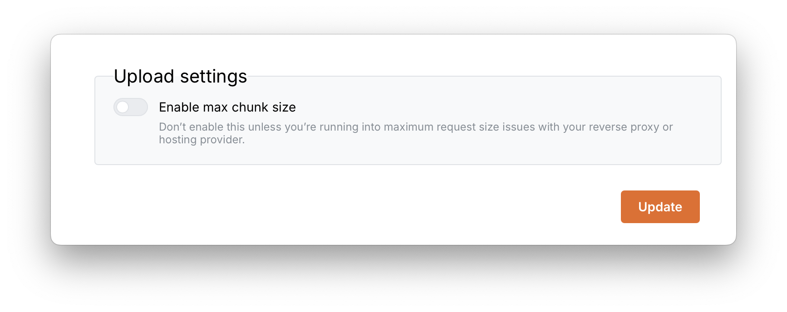

---

## Email Settings

Your users can receive unique invitation links to set up their accounts! To do
so, you must connect Storyteller to an SMTP server, allowing Storyteller to send
emails on your behalf. To do so, you will need to:

- provide the correct email settings including: host, port, credentials, ‘from’
  email address, username and password.
- set the library settings as outlined above.

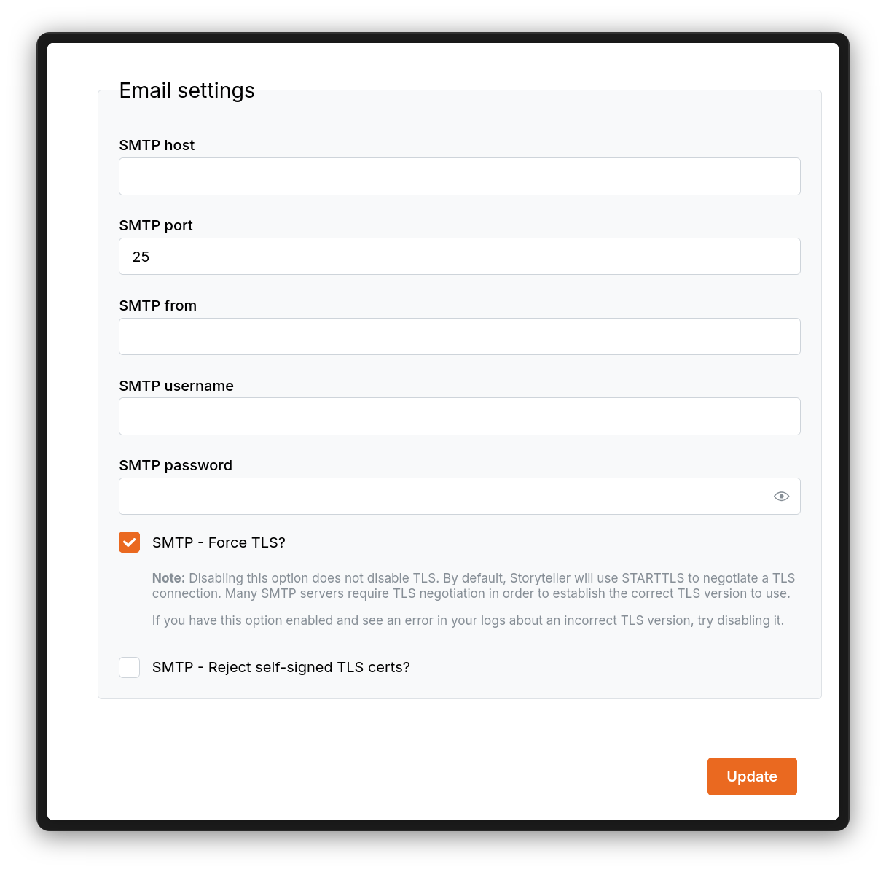

If your email provider supports SMTP, you can simply follow their instructions
for configuring email in Storyteller. Otherwise, you can use a free SMTP relay
service, such as [Sendgrid](https://sendgrid.com).

### Setting up Gmail or Proton Mail

#### Gmail

You can configure Storyteller to send email through your Gmail account, via the
Gmail SMTP server.

1. Set the SMTP host to `smtp.gmail.com`
2. Set the SMTP port to `587`
3. Set the SMTP from to your full email address
4. Set the SMTP username to your full email address
5. Set the SMTP password to an
   [app password](https://support.google.com/mail/answer/185833)
6. Do _not_ check SMTP - Force TLS — port 587 on Google's SMTP server supports
   STARTTLS
7. Do _not_ check SMTP - Reject self-signed TLS certs

#### Proton Mail

You can configure Storyteller to send email through your Proton Mail account,
via the Proton SMTP server.

Follow the instructions [here](https://proton.me/support/smtp-submission) to
generate an SMTP authentication token.

1. Set the SMTP host to `smtp.protonmail.ch`
2. Set the SMTP port to `587`
3. Set the SMTP from to your full email address
4. Set the SMTP username to your full email address
5. Set the SMTP password to your SMTP token, from the Proton docs page linked
   above.
6. Do _not_ check SMTP - Force TLS — port 587 on Proton's SMTP server supports
   STARTTLS
7. Do _not_ check SMTP - Reject self-signed TLS certs
