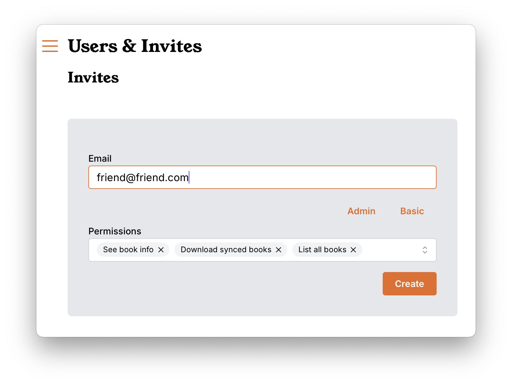
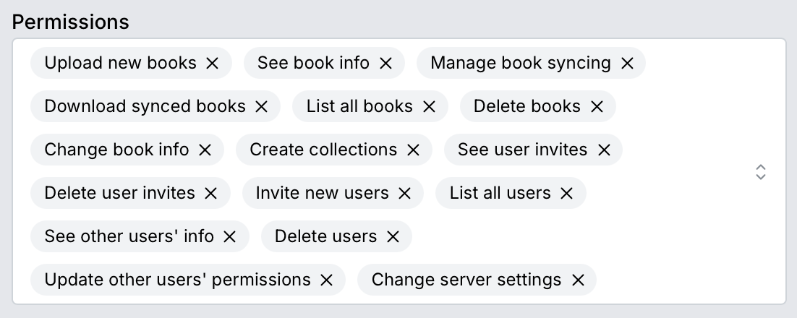

# Sharing your books

## Inviting friends and family

Afer you have done all the hard work to set up your amazing library, you may
wish to invite friend and family to your Storyteller server.

Rather than sharing a username and password, you should set up separate accounts
for each user. Setting up separate accounts will allow you to grant specific
permissions to each user.

In most cases, you'll want your users to have the "Basic User" capabilities,
which allows them to see the list of books on the server and download and play
individual books.



### Sharing invite links via email

If you have set up Storyteller’s [email settings](settings.md#email-settings),
you can use them to send the invite directly from Storyteller.

```
Hello!

You've been invited to the "Friedmans" Storyteller library.

You can accept your invite by following this link:

https://storyteller.example.com/invites/a3b1138a68b3
```

### Manually sharing invite links

If you haven't set up email in Storyteller, you can also simply copy the invite
link that Storyteller provides for you and share it with your intended users.

Make sure to have your web URL properly set up in
[library settings](settings.md#library-settings) before you share any invites as
the web URL is part of the invite code that is generated.

You may also want to send them a link to [this page](tutorials/basic-user.md) in
the documentation to help them get up and reading as quickly as possible.

---

## User permissions

You can also invite additional _administrators_, or give users fine-grained
permissions (for example, you may choose to give a user the capability to add
and align new books, but not to invite new users).



### Basic permissions

In order for users to be able to easily navigate and play books, these basic
settings are required in order to see and play any books.

- **Download books** - allows downloading of books to a device and
  playing/reading/listening to books in the app.
- **List books** - allows the user to view all books _for which they have been
  given permission_. If they are only invited to a particular collection, they
  will only see the books in that collection.
- **_Deprecated??_** - **See book details** - allows basic users to see the
  details page for individual books. When not selected the book will still be
  playable and downloadable, but the details page will not be visible. Be aware
  that if they download the book any embedded metadata will be visible in other
  applications.

### Advanced permissions

These advanced functions should probably be reserved for other administrators of
your instance.

- **Books** - Upload new books, manage book syncing
- **Collections** - Create collections
- **Invitations** - See, create new, and delete invites
- **Users** - list, see info, delete, change other user's permissions
- **Server** - Change server settings

---

## Resetting a password

If you need to reset a password for any user (including admins) you can do so by
running a script on the docker service supplying either the username or email of
the user you wish to reset. This can be done with:

```sh
# With a username
$ docker exec -it <container-name-or-id> scripts/reset-password.sh --username <username>

# With an email
$ docker exec -it <container-name-or-id> scripts/reset-password.sh --email <email>
```

---
