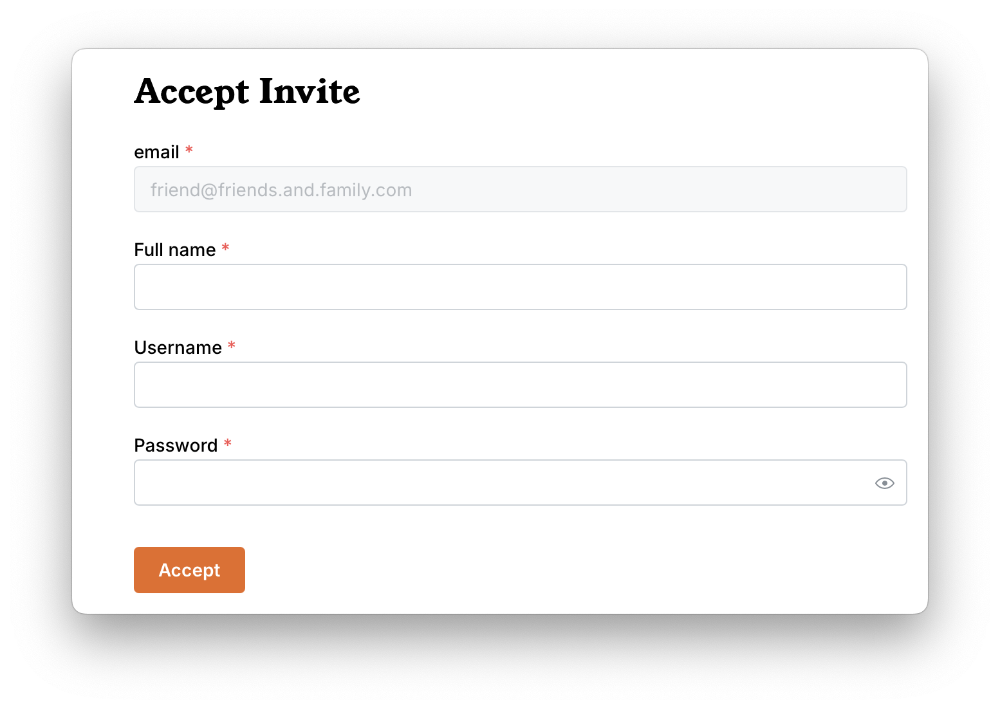

# Basic User Instructions

Congrats! Someone who loves you (or at least likes you a lot) has shared their
digital library with you! Here is the place for streamlined instructions for
basic users to get them up and running with a minimum of technical expertise.

You can enjoy you books across any devices that have the Storyteller app
installed (web reader comming soon). When reading an aligned book (ReadAloud),
your place in the book will be synced between the audio and text version. When
on the same network as the Storyteller server, your place will be synced across
all your devices.

Storyteller books can be read in many
[other apps](/docs/reading/playing-readalouds#other-apps) as well if you prefer.

The Storyteller app can be found on both the
[iOS App Store](https://apps.apple.com/us/app/storyteller-reader/id6474467720),
and the
[Google Play Store](https://play.google.com/store/apps/details?id=dev.smoores.Storyteller).

## Logging into the web server for the first time.

Because Storyteller is self-hosted, you must be on the same network as the
server to connect to it. (This is also true for the apps or upcoming web
reader.) Depending on how the owner has set up their instance, this will mean
one of three things: nothing (you are good to go!), you must be actually on the
same LAN (in their house), or you also need to be
[on their tailnet](/docs/community-guides/tailscale#your-friend-needs-to).

Once you are on the correct network, you just click the invitation link to get
to the invite/login page. 

## Using the apps

Full instructions for downloading, logging into and using the apps is found on
the [Storyteller apps page](reading/storyteller-apps.md).
